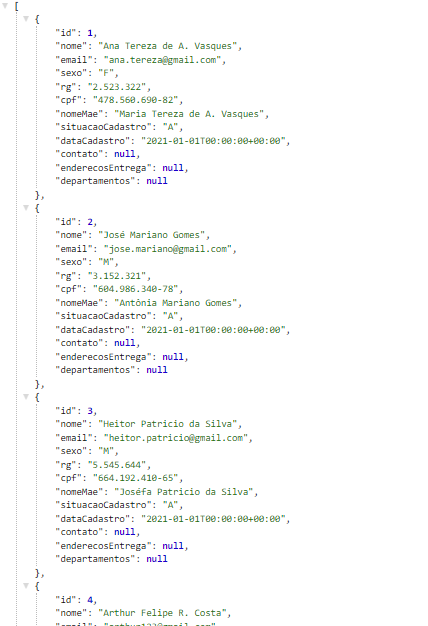
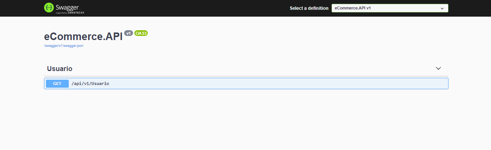

# Info-User

## Descrição do Projeto
<p align="center">
Este projeto tem como proposito o estudo das tecnologias
dotnet.core Dapper e SQL server, desta forma criando API de forma rapida e realizando uma listagem do banco SQL Server.
</p>

<h1 align="center">
    <a href="https://github.com/DapperLib/Dapper/">🔗 Dapper</a>
</h1>
<p align="center">🚀Dapper - a simple object mapper for .Net</p>

## How to Install

### Backend (API)

* To download the project follow the instructions bellow:

```
1. git clone 
2. cd Dapper
```

* Install the dependencies and start the server:

```
3. dotnet build
4. dotnet run
```

## Screen Shots


* Listing UserInfo



* Swagger


